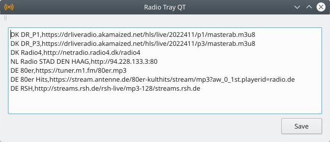

# radiotray-qt
Internet radio player for Linux
Written in Qt-Creator

## Screenshots
###### Right Click System Tray Icon

###### Left Click System Tray Icon

## Installation
1. git clone https://github.com/ErikLethDanielsen/radiotray-qt.git
2. Open in qt-creator
3. Run / Build
4. exe is in /Output folder
5. Run it. 

## Dependencies
sudo apt install 
qtmultimedia5-dev libqt5multimediawidgets5 libqt5multimedia5-plugins libqt5multimedia5 qml-module-qtmultimedia

## Info
On Linux it utilizes GStreamer 
https://gstreamer.freedesktop.org/documentation/frequently-asked-questions/using.html?gi-language=c 
gst-launch-1.0 playbin uri=https://netradio.radio4.dk/radio4

## Contributing

## License
[MIT](https://choosealicense.com/licenses/mit/)
Copyright (c) 2021 Erik Leth Danielsen meldco.dk
